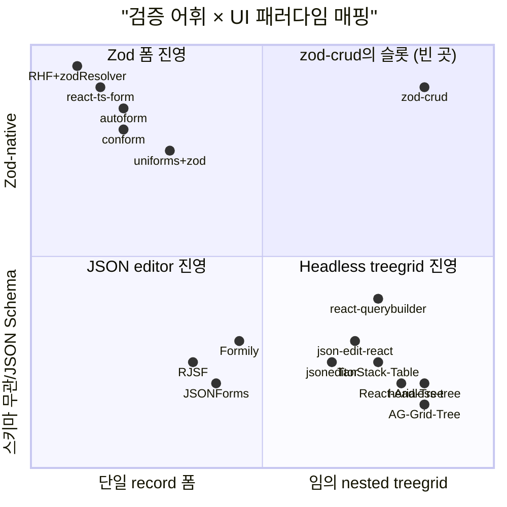
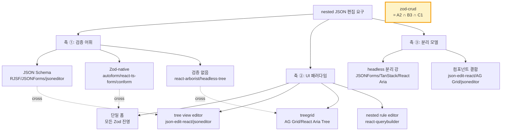

# zod-crud와 유사한 프로젝트 — 생태계 슬롯 분석

## TL;DR

- **결론: zod-crud의 4-튜플(Zod 검증 · headless 분리 · flat node table · 임의 nested JSON treegrid CRUD)을 한 라이브러리로 채우는 OSS는 발견되지 않았다.**
- Zod-UI 진영(autoform, react-ts-form, uniforms, conform 등)은 **100% 단일 record 폼 패러다임** — nested object는 아코디언, array는 repeatable group으로 풀 뿐 treegrid가 아니다.
- JSON-editor 진영(RJSF, JSONForms, json-edit-react, jsoneditor)은 **검증이 JSON Schema 고정**이거나 **headless 분리가 약함**. Zod-native가 아니다.
- Headless treegrid 진영(React Aria Tree, TanStack Table, headless-tree, react-arborist)은 **검증 어휘가 비어있음** — 트리 골격만 제공하고 schema 검증은 호출자 책임.
- 가장 가까운 슬롯 인접자 셋: **JSONForms**(headless 분리 강) · **json-edit-react**(tree-editor UI 비슷) · **react-querybuilder**(nested treegrid 형식). 어느 하나도 4축을 모두 커버하지 못한다.

## Why — 왜 이 질문이 지금 중요한가

[`spec.md`](../../../../spec.md) · [`prd-headless-treegrid-migration.md`](../../../../prd-headless-treegrid-migration.md) 기준 zod-crud는 "Zod 스키마로 보호된 flat JSON tree 라이브러리" (editor 아님 — JSON tree 자체를 CRUD/clipboard/history 어휘로 다루는 엔진) — `createJsonCrud(schema, value)` → `JsonNode{id, type, parentId, key, children, value}` 평면 노드 + clipboard/history/CRUD가 1차 시민. 현재 headless 패턴(`@p/aria-kernel`) 마이그레이션 진행 중이며 W3C APG treegrid 어휘(roving tabindex, aria-activedescendant, Home/End)를 정확히 emit하는 것이 목표.

이 슬롯이 외부에 이미 채워져 있다면 우리 작업은 재발명. 비어있다면 신규 포지셔닝. **갭이 진짜인지의 외부 검증**이 이 조사의 동기다.

## How — 생태계 3축 매핑과 빈 슬롯의 위치

조사 대상 OSS를 두 개 직교축에 배치하면 zod-crud의 슬롯이 시각적으로 드러난다.

세 진영의 정체성 흐름:

핵심: **Zod-native(A2) × treegrid(B3) × headless(C1)** 의 교집합에 OSS가 비어있다. 두 축의 교집합은 곳곳에 있지만 세 축 동시는 zod-crud뿐이다.

## What — 카테고리별 후보 매트릭스

### ① Zod → UI 자동 생성 진영 (단일 폼 패러다임)

| 라이브러리 | ★ | 출력 UI | Zod | nested treegrid? |
|---|---|---|---|---|
| [vantezzen/autoform](https://github.com/vantezzen/autoform) | ~3.5k | 단일 폼 (nested → accordion) | ✓ | ✗ |
| [iway1/react-ts-form](https://github.com/iway1/react-ts-form) | ~2.4k | 단일 폼, 컴포넌트 매핑 | ✓ only | ✗ |
| [vazco/uniforms](https://github.com/vazco/uniforms) + zod bridge | ~2.0k | 단일 폼, 다중 테마 | bridge | ✗ |
| [react-hook-form/resolvers](https://github.com/react-hook-form/resolvers) (zodResolver) | ~43k | 수동 단일 폼 | ✓ | ✗ |
| [edmundhung/conform](https://github.com/edmundhung/conform) | ~6.7k | 점진적 향상 폼 | Standard Schema | ✗ |
| [thepeaklab/zod-form-renderer](https://github.com/thepeaklab/zod-form-renderer) | ~150 | 단일 폼 (Zod v4 미지원) | ✓ only | ✗ |

**전수 100%가 단일 record `<form>`**. nested object는 펼쳐진 섹션, array는 repeatable group으로만 처리. treegrid 출력은 카테고리에 부재.

### ② JSON Schema 기반 nested editor 진영

| 라이브러리 | ★ | UI | 검증 | Headless |
|---|---|---|---|---|
| [react-jsonschema-form](https://github.com/rjsf-team/react-jsonschema-form) | ~15.5k | nested form (move up/down) | JSON Schema | 부분 |
| [eclipsesource/jsonforms](https://github.com/eclipsesource/jsonforms) | ~2.5k | data + UI schema 분리 | JSON Schema | **강함** |
| [CarlosNZ/json-edit-react](https://github.com/CarlosNZ/json-edit-react) | ~1k+ | **편집 가능 tree view** | onUpdate 외부 | 약함 |
| [josdejong/jsoneditor](https://github.com/josdejong/jsoneditor) | ~11.6k | tree mode editable + code | AJV 경고만 | 없음 |
| [alibaba/formily](https://github.com/alibaba/formily) | ~12.7k | reactive nested form | JSON Schema ↔ JSchema | 중간 |
| [react-querybuilder](https://github.com/react-querybuilder/react-querybuilder) | ~4.5k | **nested rule treegrid** | 자체 ruleset | 중간 |

**가장 가까운 3 후보 결정적 차이**:
1. **JSONForms** — headless 분리는 가장 강하나 검증이 **JSON Schema 고정**(AJV). flat node table 모델 아님.
2. **json-edit-react** — UI는 tree-editor로 비슷하나 **headless 분리가 없음**(컴포넌트 자체가 뷰), schema는 후행 콜백.
3. **react-querybuilder** — nested treegrid 형식은 닮았으나 도메인이 query rule에 한정. 임의 Zod 일반화 아님.

### ③ Headless treegrid + structural editor 진영 (인사이트풀 대안)

| 라이브러리 | 컨셉 | zod-crud와의 차별점 |
|---|---|---|
| [React Aria Tree (Adobe)](https://react-spectrum.adobe.com/react-aria/Tree.html) | APG treegrid + roving tabindex 자동 emit | 표시/선택 최적, 검증 없음 |
| [AG Grid self-referential tree](https://www.ag-grid.com/react-data-grid/tree-data-self-referential/) | parentId 평면 모델 + 트랜잭션 업데이트 | 풀 컴포넌트, 엔터프라이즈 라이선스 |
| [TanStack Table v8 expanding](https://tanstack.com/table/v8/docs/guide/expanding) | `getSubRows` nested, headless 표준 | ARIA treegrid 어휘는 소비자 책임 |
| [headless-tree (lukasbach)](https://headless-tree.lukasbach.com/) | feature-pluggable, id 기반 평면 데이터 로더 | Zod-native 검증 미포함 |
| [react-arborist](https://github.com/brimdata/react-arborist) | onCreate/onMove/onDelete 핸들러 | nested 데이터 가정, 검증 부재 |
| [ProseMirror](https://prosemirror.net/docs/guide/) / [Tiptap](https://tiptap.dev/docs/editor/core-concepts/schema) | schema-validated structural editor | **텍스트 문서 트리 도메인** |
| [BlockSuite](https://block-suite.com/blog/document-centric.html) / [Yjs](https://github.com/yjs/yjs) | block/CRDT JSON 트리 | 임의 Zod 정적 스키마 1급 아님 |

**"ProseMirror가 텍스트에 한 일을 임의 JSON에 한" 정확한 1:1 OSS는 부재**. 가장 흥미로운 인접: headless-tree(평면 모델 + feature plugin) + Zod 어댑터를 직접 결합한 형태가 zod-crud와 정신적으로 가장 가깝다.

## What-if — 우리 프로젝트에 적용하면

- **차별 메시지를 외부에 잡을 때**: "Zod-validated headless treegrid CRUD" 한 줄로 충분히 빈 슬롯을 점유한다. autoform/JSONForms/json-edit-react 어느 것도 이 슬롯을 동시에 채우지 못한다.
- **API 어휘 차용 후보**:
  - APG 어휘: [W3C APG treegrid](https://www.w3.org/WAI/ARIA/apg/patterns/treegrid/)는 정본 — `prd-headless-treegrid-migration.md`의 aria-activedescendant/Home/End 결정과 일치.
  - 평면 모델: AG Grid `treeDataParentIdField` + `getRowId` 형태가 가장 가깝다 — `JsonNode.parentId`는 사실상 같은 결정.
  - 검증 분리: JSONForms의 data schema ↔ UI schema 분리가 좋은 모범. zod-crud는 schema 하나로 통합되어 있어 더 단순하다는 게 차별 포인트가 될 수 있다.
- **고려할 차용 안 하는 결정**: react-jsonschema-form 어휘(uiSchema, widget map)는 끌어들이면 형식이 무거워진다. zod-crud의 "Zod 하나만으로 충분"이라는 단순성은 유지가 더 가치 있다.
- **샘플 앱 포지셔닝**: `apps/showcase`는 의도적 test bench라 사용자가 zod-crud의 위치를 못 잡는다. 별도 "demo product" — 예: 스키마 기반 JSON tree 다루기 한 화면(설정 트리, 카테고리 트리, AST 뷰 등) — 를 만들면 슬롯이 명확해진다.

## 흥미로운 이야기

- **Zod-UI 진영의 폼 고착**은 우연이 아니다. autoform/react-ts-form/uniforms 모두 **react-hook-form + zodResolver**라는 사실상 표준 위에 얹혀있고, RHF의 `useForm`이 단일 객체 단위라 자연히 단일 폼 출력으로 수렴한다. **TanStack Form**이 Standard Schema로 Zod 1급을 들이면서 폼 진영의 표준 위치를 약간 흔들고 있지만 여전히 트리는 없다.
- **JSON Schema 진영(RJSF)이 Zod를 받지 않는 이유**는 정치적이다. RJSF는 [Standard Schema 채택 issue #4614](https://github.com/rjsf-team/react-jsonschema-form/issues/4614)에서 논의 중이지만 검증 어휘가 JSON Schema 자체에 깊이 묶여있어 쉽지 않다. zod-crud는 이 길의 반대편 — Zod를 1급으로 두고 JSON Schema는 무시 — 을 택한 셈.
- **ProseMirror schema 모델은 13년 가까이 텍스트 편집계의 정본**으로 자리잡았다. 같은 정신을 임의 JSON 데이터에 적용하면 zod-crud가 된다 — 아무도 명시적으로 그렇게 부르지 않았을 뿐. BlockSuite가 가장 근접한 형제이지만 "block tree"라는 별도 추상이 끼어있다.
- **react-querybuilder**가 의외로 가장 형식이 닮았다 — nested group/rule을 treegrid로 편집하고 검증이 ruleset shape에 묶인다. 도메인을 좁힌 zod-crud의 친척이라고 봐도 좋다.

## Insight

zod-crud는 **Zod-native × headless × APG treegrid × flat node table**의 4축 동시 만족이라는 **외부에 비어있는 슬롯**을 차지한다. 인접 OSS가 셋씩은 채워도 넷째 축에서 깨진다. 단순 비교 메시지로는 "Zod 시대의 RJSF/JSONForms" 또는 "임의 JSON에 적용된 ProseMirror 정신"이 외부 청중에게 가장 빠르게 꽂힌다.

**프로젝트 규약과의 정합성**: 일치. 본 조사는 외부 BP를 들여와 내부 결정을 뒤집자고 주장하지 않는다 — 외부에 정확한 슬롯의 BP가 부재하므로 zod-crud 자체가 그 카테고리의 1차 후보다. `prd-headless-treegrid-migration.md`의 W3C APG treegrid 채택 결정은 외부 정본([APG treegrid pattern](https://www.w3.org/WAI/ARIA/apg/patterns/treegrid/))과 정확히 정렬되어 있어 추가 변경 권고 없음.

## 출처

### Zod 폼 진영
- [vantezzen/autoform](https://github.com/vantezzen/autoform) — Schema-agnostic 코어 + Zod/Yup provider, shadcn/MUI 렌더러
- [iway1/react-ts-form](https://github.com/iway1/react-ts-form) — Zod → 타입세이프 RHF 매핑
- [vazco/uniforms](https://github.com/vazco/uniforms) · [uniforms-bridge-zod](https://www.npmjs.com/package/uniforms-bridge-zod) — schema bridge 아키텍처
- [react-hook-form/resolvers](https://github.com/react-hook-form/resolvers) — 사실상 표준 Zod 폼 조합
- [edmundhung/conform](https://github.com/edmundhung/conform) — 서버액션/PE 중심 폼
- [thepeaklab/zod-form-renderer](https://github.com/thepeaklab/zod-form-renderer) — Zod → RHF 자동 매핑
- [arkemis-labs/shadcn-zod-form](https://github.com/arkemis-labs/shadcn-zod-form) — CLI scaffold류

### JSON editor 진영
- [rjsf-team/react-jsonschema-form](https://github.com/rjsf-team/react-jsonschema-form) · [Standard Schema issue #4614](https://github.com/rjsf-team/react-jsonschema-form/issues/4614)
- [eclipsesource/jsonforms](https://github.com/eclipsesource/jsonforms) — data + UI schema 분리
- [CarlosNZ/json-edit-react](https://github.com/CarlosNZ/json-edit-react) — 편집 가능 tree view
- [josdejong/jsoneditor](https://github.com/josdejong/jsoneditor) — tree/code 모드 vanilla
- [mac-s-g/react-json-view](https://github.com/mac-s-g/react-json-view) — tree view (미유지보수)
- [alibaba/formily](https://github.com/alibaba/formily) — reactive schema-driven
- [react-querybuilder](https://github.com/react-querybuilder/react-querybuilder) — nested rule treegrid

### Headless treegrid + structural editor
- [W3C APG Treegrid pattern](https://www.w3.org/WAI/ARIA/apg/patterns/treegrid/) — 정본 ARIA 어휘
- [MDN treegrid role](https://developer.mozilla.org/en-US/docs/Web/Accessibility/ARIA/Roles/treegrid_role)
- [React Aria Tree (Adobe Spectrum)](https://react-spectrum.adobe.com/react-aria/Tree.html)
- [AG Grid Tree Data self-referential](https://www.ag-grid.com/react-data-grid/tree-data-self-referential/)
- [TanStack Table v8 expanding](https://tanstack.com/table/v8/docs/guide/expanding)
- [TanStack Form validation (Standard Schema)](https://tanstack.com/form/latest/docs/framework/react/guides/validation)
- [headless-tree (lukasbach)](https://headless-tree.lukasbach.com/)
- [react-arborist](https://github.com/brimdata/react-arborist)
- [ProseMirror Guide](https://prosemirror.net/docs/guide/) · [Tiptap Schema](https://tiptap.dev/docs/editor/core-concepts/schema)
- [BlockSuite document-centric](https://block-suite.com/blog/document-centric.html) · [Yjs](https://github.com/yjs/yjs)
