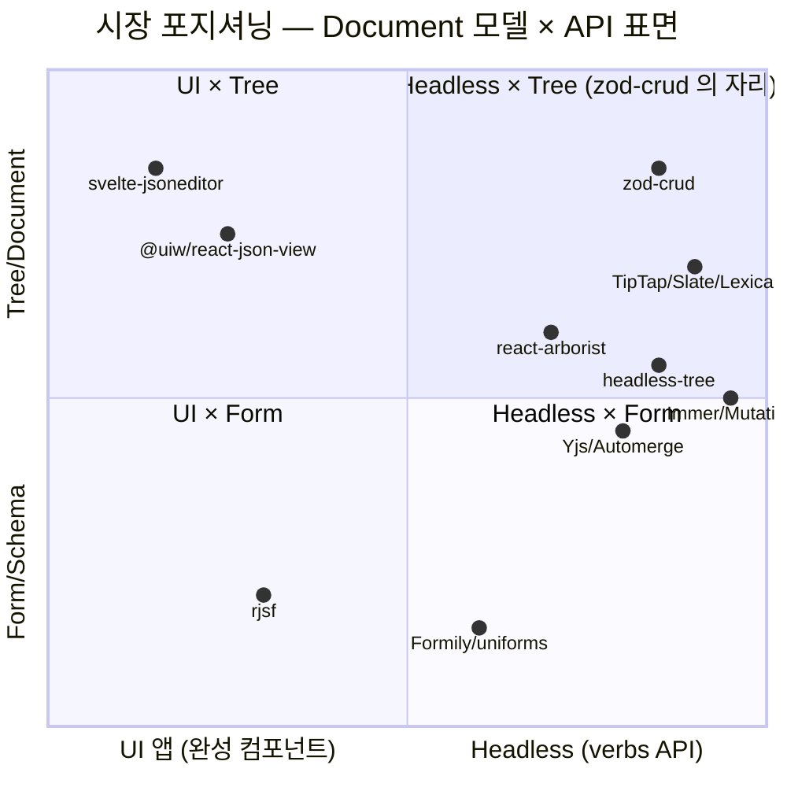
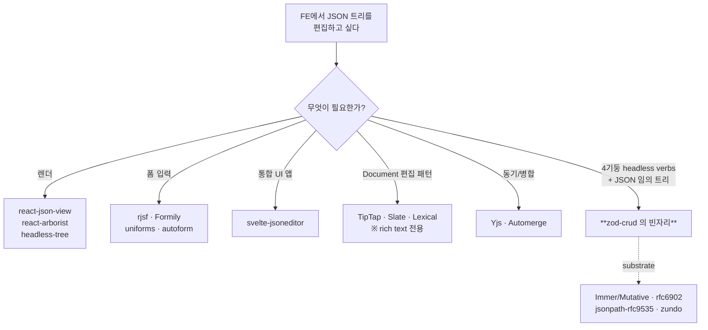

# zod-crud 대체재 조사 — 빈 자리 검증

## TL;DR

- "**JSON tree** + **4기둥(select/edit/clipboard/undo)** + **headless commands+can** + **Zod**" 4 조건을 동시에 충족하는 라이브러리는 **부재**.
- 가장 기능적으로 가까운 것은 `svelte-jsoneditor` — 그러나 **UI 앱**이고 Svelte 기반이라 zod-crud 의 React headless 표준화 레이어 포지션과 어긋난다.
- 시장은 **세 축으로 분산**돼 있음: ① tree UI 렌더(arborist 류) ② document 편집 패턴(TipTap/Slate/Lexical, 도메인=rich text) ③ 동기·병합(Yjs/Automerge). zod-crud 는 이들 사이 빈자리를 차지한다.
- 진짜 경쟁은 **TipTap 의 commands+can 패턴**이다 — 도메인은 다르지만 API 표면이 같은 자리에서 학습된 기대치를 만든다.

## Why — 왜 이 질문이 지금 중요한가

MEMORY 는 zod-crud 의 정체성을 "FE 표준화 레이어 / JSON tree 라이브러리"로 못박았다(`project_zod_crud_mission`, `project_zod_crud_identity`). 자체 RFC 9535 구현 ~1550 LOC 까지 들였다(`project_zod_crud_rfc9535_self_impl`). 이 결정은 "이미 있는 라이브러리로 충분하지 않다"는 전제 위에 서 있다 — 그 전제를 외부 좌표계로 검증해야 한다. 만약 동일 포지션 라이브러리가 있다면 v0.x 동안 substrate 교체가 합리적이고, 없다면 자체 구축의 정당성이 강화된다.

## How — 시장 지형의 구조

## What — 후보 라이브러리와 4기둥 커버리지

### A. JSON tree 직접 조작
| 라이브러리 | select | edit | clip | undo | 비고 |
|---|---|---|---|---|---|
| `@uiw/react-json-view` | ⚠️ | ⚠️ | ❌ | ❌ | 렌더 컴포넌트 (보완재) |
| `svelte-jsoneditor` | ✅ | ✅ | ✅ | ✅ | **기능 풀세트지만 UI 앱·Svelte** |
| `@json-editor/json-editor` | ❌ | ✅ | ❌ | ❌ | schema→form (다른 축) |
| `@rjsf/core` | ❌ | ✅ | ❌ | ❌ | schema→form |
| Formily / uniforms / `@autoform/zod` | ❌ | ✅ | ❌ | ❌ | schema→form |

### B. Headless tree (UI 인터랙션만)
| | select | edit | clip | undo |
|---|---|---|---|---|
| `react-arborist` | ✅ | ⚠️rename | ❌ | ❌ |
| `react-complex-tree` / `@headless-tree/react` | ✅ | ⚠️ | ❌ | ❌ |

→ tree **렌더+선택+DnD** 만 — JSONPath/patch/document 모델 없음.

### C. 편집기 프레임워크 (commands+can 패턴 원조)
| | select | edit | clip | undo | 도메인 |
|---|---|---|---|---|---|
| TipTap / ProseMirror | ✅ | ✅ | ✅ | ✅ | rich text |
| Slate.js | ✅ | ✅ | ✅ | ✅ | rich text (JSON-shaped) |
| Lexical | ✅ | ✅ | ✅ | ✅ | rich text |

→ **API 패턴 직접 영감원**. 도메인이 텍스트라 임의 JSON 트리에 그대로 못 씀.

### D. Substrate (보완재 — 위에 얹어 쓰는 부품)
- `Immer` / `Mutative` — produce + patches
- `fast-json-patch` / `rfc6902` — JSON Patch RFC 6902 표준
- `zundo` / `use-undo` / Mutative `Travels` — undo middleware
- `jsonpath-rfc9535` / `json-p3` — RFC 9535 100% 호환 신규 구현 (`jsonpath-plus` 는 RFC 이전 fork·사실상 abandoned)

### E. 다른 축 — 로컬 퍼스트/CRDT
- Yjs (`UndoManager` 내장), Automerge, Jazz.tools, Triplit — **동기·병합**. 단일 클라이언트 표준화 레이어인 zod-crud 와 직교.

## What-if — 우리 프로젝트에 적용하면

1. **substrate 교체 시나리오**: zod-crud 자체 RFC 9535 → `jsonpath-rfc9535` 로 교체하면 ~1550 LOC 절약. 그러나 MEMORY 의 "외부 dep 없이 자체 구현" 결정과 충돌 (`project_zod_crud_rfc9535_self_impl`). 정합성 우선 → 보류.
2. **Mutative + rfc6902 채택 가능성**: reducer 내부에 patches 생성용으로 도입하면 undo/redo 의 메모리 효율과 직렬화(서버 전송·CRDT 송출)가 같이 풀림. v0.x 후반에 검토 가치.
3. **포지셔닝 메시지**: README/홈페이지에 "TipTap 의 commands+can 을 임의 JSON 트리로 가져왔다 + Zod schema 검증 + RFC 9535 selection" 한 줄. 비교 대상이 없으니 **유추 앵커**가 필요.
4. **수렴 위협**: svelte-jsoneditor 의 React 포팅이 등장하면 UI 앱 축에서 직접 충돌. 단, zod-crud 는 headless 라 **겹치지 않게 분리** 가능.

## 흥미로운 이야기

JSON tree 편집의 역사는 두 흐름의 합류다.

- **Schema-first 흐름** (2014~): JSON Schema 가 표준화되며 `react-jsonschema-form` 같은 form generator 가 폭발. "데이터 → 폼"이 지배적 메탈모델이 됨. 그러나 "트리 자체를 편집"하는 도구는 거의 없음 — 데이터를 항상 *입력 폼* 으로 환원했음.
- **Editor framework 흐름** (2018~ ProseMirror→TipTap, Slate, Lexical): rich text 라는 좁은 도메인에서 commands+can+history 패턴이 **사실상 표준**으로 굳어짐. 그러나 도메인이 텍스트라 임의 JSON 으로 못 빠져나옴.

zod-crud 는 이 두 흐름의 **교차점에서 비어 있던 자리**를 차지한다 — Editor 의 API 패턴을 가져오되 도메인을 임의 JSON 트리로, 검증을 Zod 로. RFC 9535 가 2024년 표준화된 것도 타이밍이 맞다 — selection/path 를 표준 어휘로 표현할 기반이 이제 막 생겼다.

또 하나의 빈자리는 **Immer 의 후속**이다. Mutative 가 "Immer 보다 빠른 produce + patches"로 등장했고, `Travels` 라는 undo 미들웨어를 내놓으며 동일 패턴을 따라가고 있다. zod-crud 의 reducer 가 이쪽 substrate 와 어떻게 정합할지가 v1.0 전에 답해야 할 질문이다.

## Insight

**한 줄 결론**: zod-crud 의 포지션(React headless × 임의 JSON 트리 × 4기둥 × Zod)은 외부에 직접 대체재가 없다. 자체 구축의 정당성은 외부 좌표계로도 확인된다.

**프로젝트 규약과의 정합성 판정**: ✅ **일치**. 조사된 어떤 라이브러리도 MEMORY 의 정체성 정의 ("FE 표준화 레이어 / JSON tree / 4기둥") 를 동시 만족하지 못함. `feedback_judgment_priority` 충돌 없음.

**다만 두 가지 부분 충돌 신호**:
- substrate 자체 구현 정책 (`project_zod_crud_rfc9535_self_impl`) 은 RFC 9535 호환 라이브러리(`jsonpath-rfc9535`, `json-p3`) 가 성숙하면 재검토할 여지가 생긴다 — 지금은 보류, v1.0 검증 누적 시점에 재방문.
- Immer/Mutative + rfc6902 도입은 "외부 dep 없이"와 약한 충돌. patches 표준화 가치가 크면 예외 검토.

## 출처
- [@uiw/react-json-view](https://www.npmjs.com/package/@uiw/react-json-view) — React JSON viewer 컴포넌트
- [svelte-jsoneditor (josdejong)](https://github.com/josdejong/svelte-jsoneditor) — tree/text/table 모드 통합 UI 앱
- [@json-editor/json-editor](https://github.com/json-editor/json-editor) — JSON Schema → form
- [react-jsonschema-form](https://github.com/rjsf-team/react-jsonschema-form) — schema-driven form
- [@autoform/zod](https://autoform.vantezzen.io/docs/schema-providers/zod) — Zod schema → form
- [react-arborist](https://github.com/brimdata/react-arborist) — virtualized tree UI
- [react-complex-tree](https://github.com/lukasbach/react-complex-tree) / [@headless-tree/react](https://www.npmjs.com/package/@headless-tree/react) — accessible headless tree
- [TipTap commands (ProseMirror)](https://tiptap.dev/docs/editor/core-concepts/prosemirror) — commands+can 패턴
- [Slate.js](https://docs.slatejs.org) — JSON-shaped document editor
- [Lexical](https://lexical.dev) — Meta 의 editor 프레임워크
- [Mutative](https://github.com/mutativejs/mutative) / [Travels](https://github.com/mutativejs/travels) — Immer 후속 + undo 미들웨어
- [fast-json-patch](https://www.npmjs.com/package/fast-json-patch) / [rfc6902](https://www.npmjs.com/package/rfc6902) — JSON Patch
- [jsonpath-rfc9535](https://www.npmjs.com/package/jsonpath-rfc9535) / [json-p3](https://jg-rp.github.io/json-p3/) — RFC 9535 호환 구현
- [Yjs](https://github.com/yjs/yjs) / [Automerge](https://automerge.org) — CRDT 동기·병합
